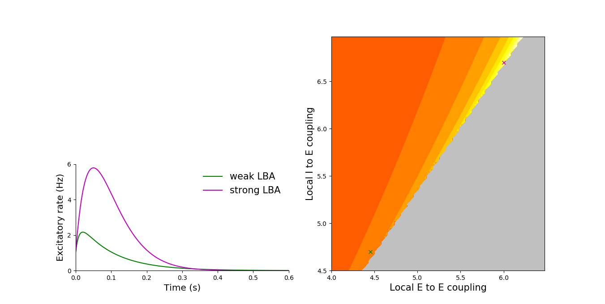
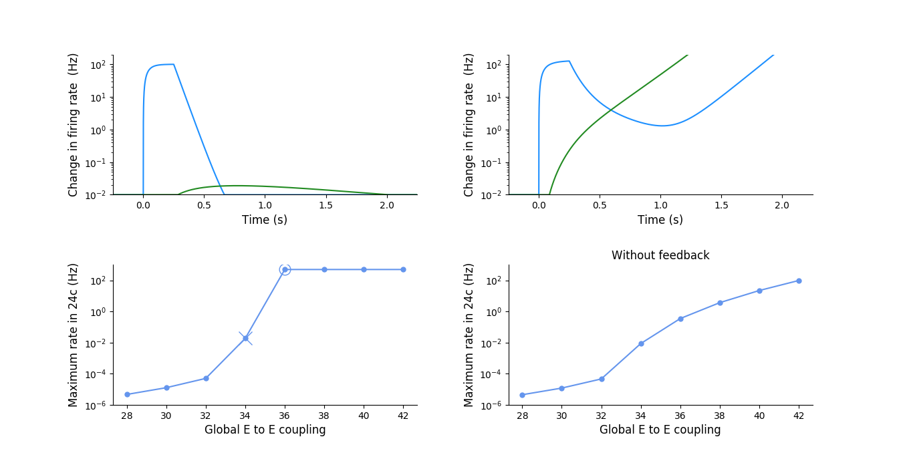
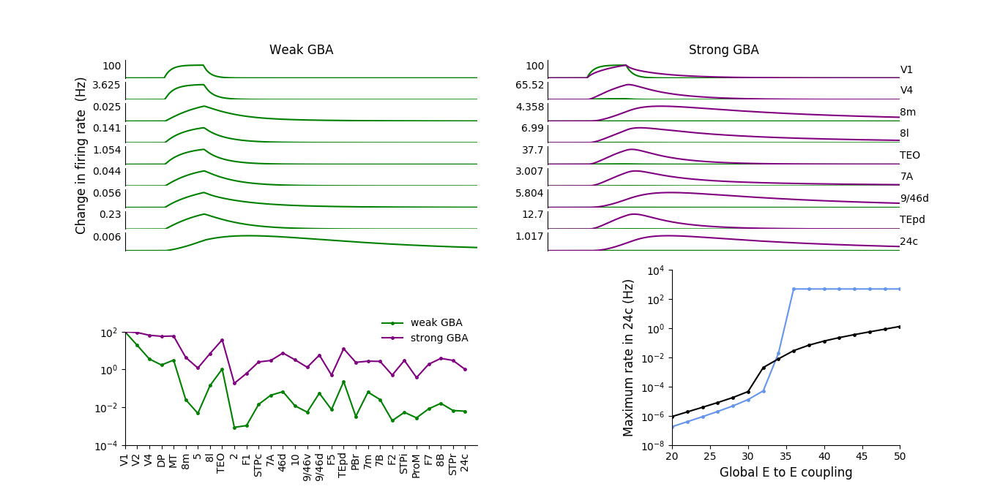
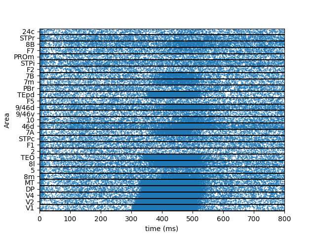
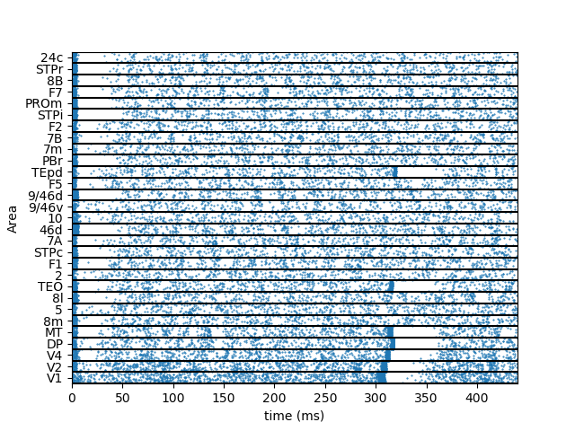
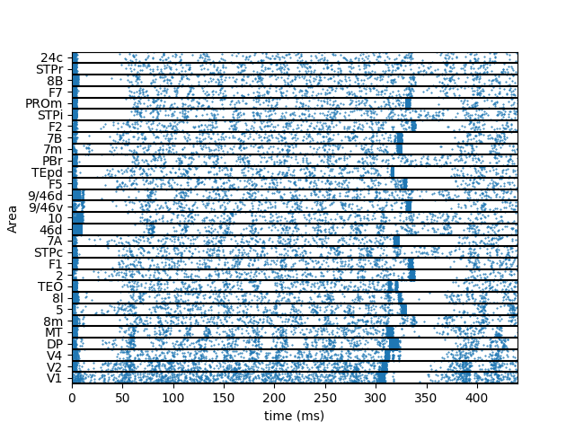

## Google Summer of Code 2020

### Project: Conversion of large scale cortical models into PyNN/NeuroML

#### Student: Ronaldo Nunes

#### Codes: [Part1](https://github.com/OpenSourceBrain/JoglekarEtAl18) and [Part2](https://github.com/OpenSourceBrain/DemirtasEtAl19)

    
I have been working from June to August in a project as part of the Google Summer of Code 2020 (GSoc 2020). The goal of my project was to implement in PyNN and NeuroML(lite) previously published large-scale brain models. I proposed two models: (1) a model published by [Joglekar et al.](https://www.cell.com/neuron/fulltext/S0896-6273(18)30152-1) for the macaque monkey cortex using rate models, spiking neuronal networks and anatomical data from retrograde tracing and (2) a model for the human brain published by [Demirtas et al.](https://www.sciencedirect.com/science/article/pii/S0896627319300443) using simulated BOLD signals and anatomical data obtained by Diffusion Tensor Imaging (DTI). During the project, I was supported by my mentors, Padraig Gleeson and Ankur Sinha, and the International Neuroinformatics Coordinating Facility (INCF). Here, I am going to give a short explanation about the main tools used, summarize the steps of the project, the challenges that I faced during implementation, and the future work that will be done.

## Tools

#### PyNN

[PyNN](https://neuralensemble.org/PyNN/) is a python package for simulation of spiking neuronal network models. Through PyNN it is possible to implement models in a simulator-independent language and run using some simulator backends, for example, [Neuron](https://neuron.yale.edu/neuron/), [BRIAN](https://briansimulator.org/) and [NEST](https://www.nest-initiative.org/?page=Software).

#### Neuroml(lite)

[Neuroml(lite)]() is a  a common framework for reading/writing/generating network created to standardize the description of computational neuroscience models. Using Neuroml(lite) the exported codes can be simulated in PyNN, jNeuroMl, Neuron and NetPyne.

## Project

### JoglekarEtAl18

[Codes](https://github.com/OpenSourceBrain/JoglekarEtAl18)

This paper aims to show that the balanced amplification between cortical areas enhances signal propagation in a large-scale model for the macaque monkey cortex. First, they showed using a simple rate model, composed of one excitatory and one inhibitory population, that local balanced amplification causes an increase of the firing rate for the excitatory population. It was also presented the relation between peak of firing rate in excitatory population and the weights for connections from excitatory to excitatory and from inhibitory to excitatory.

They created a large-scale cortical model where the dynamical behavior of each area was described by interacting populations of excitatory and inhibitory.  Each cortical area was described by the same model in the previous analysis. They found that activity propagation in a large-scale cortical model with long-range excitatory connections leads to either strong attenuation or instability.

They extended the idea to local balanced amplification to a large-scale cortical model. In global balanced amplification (GBA) the strong long-range excitation is stabilized by the local inhibition. It was showed that the global balanced amplification improves signal propagation.

The idea of GBA was also implemented to a more detailed model proposed by [Mejias et al.](https://advances.sciencemag.org/content/2/11/e1601335). This paper's main result was the propagation of signal (asynchronous and synchronous) between spiking neuronal networks that describe the activity of each cortical area in the large scale cortical model. 

Weak GBA - Asynchronous             |  Strong GBA - Asynchronous
:-------------------------:|:-------------------------:
  |  

Weak GBA - Synchronous             |  Strong GBA - Synchronous
:-------------------------:|:-------------------------:
  |  

#### Implementation and challenges

Fortunately, the original codes in Brian2 and Matlab were available on Github. I organized the codes in Brian2 to generate different simulations using the same main code. Thus, by parsing command-line arguments, it is possible to choose the result simulated,  the number of areas, and the signal (synchronous or asynchronous). The first challenge was to implement the large-scale model with spiking neuronal networks in PyNN. In the original code, the synapses are given by a delta function; it means an action potential in the presynaptic neuron generates a discrete increment in the postsynaptic potential. However, delta-function synapses are not implemented in PyNN. To overcome this situation, I verified what parameters make alpha-function synapses behave like the delta synapses in the model. There was a linear relation between synaptic weights for delta-function synapses and alpha-function synapses. After this analysis, the model was implemented, and several tests were done.

Rate models were all implemented in Python. The initial code to reproduce the results using the Mejias et al. model and GBA was done; however, it requires more tests and adjustment of parameters. Moreover, it was implemented in Neuroml(lite) a code for simple rate model and initial code for spiking neuronal networks.

#### Future steps
* Large scale model with spiking neuronal networks in Neuroml(lite)
* Implementation of codes for results about Signal Propagation and Conscious Perception
- Search of parameters for results using Mejias et. al. model.
- Implementation of large scale rate model in Neuroml(lite).

### DemirtasEtAl19

[Codes](https://github.com/OpenSourceBrain/DemirtasEtAl19)

In this work, the authors showed that large-scale dynamics are shaped not only by the interactions among local areas but also by the heterogeneity of underlying local properties.  In order to show this, it was created a large-scale cortical model for the Human cortex. This model predicts the hierarchical organization of the power spectrum and fits functional connectivity obtained by resting-state functional magnetic resonance imaging (fMRI). The codes and analysis of this project are in the initial phase since most of the my work in GSOC 2020 was dedicated to the first part of the project. 

We generate a code to plot the structural connectivity and the state variables for the large-scale model. These state variables are currents I, firing rate R, synaptic gating S, and the BOLD signal.

It is showed below state variables for 10 out of 180 areas.

*Log10 of Structural Connectivity            
  

* Currents - Excitatory            
  
* Currents - Inhibitory

* Firing Rates - Excitatory            
  
* Firing Rates- Inhibitory

* Synaptic Gating - Excitatory            
  
* Synaptic Gating - Inhibitory

* BOLD            
  

#### Implementation and challenges
 
 I started this part of the project in the last month of the project, so the first challenge was to understand the paper's ideas and implement codes to reproduce the figures in a very short time. The original codes are available as a python package; however, they are not straightforward. With my mentors' help, I did the kickoff on this part of the project.  

#### Future steps
* Codes in python to reproduce each figure in the paper
* Codes in NeuroMl(lite) for the large-scale model

## References

* *Davison, Andrew P., et al. "PyNN: a common interface for neuronal network simulators." Frontiers in neuroinformatics 2 (2009): 11.*

* *Cannon, Robert C., et al. "LEMS: a language for expressing complex biological models in concise and hierarchical form and its use in underpinning NeuroML 2." Frontiers in neuroinformatics 8 (2014): 79.*

* *Joglekar, Madhura R., et al. "Inter-areal balanced amplification enhances signal propagation in a large-scale circuit model of the primate cortex." Neuron 98.1 (2018): 222-234.*

* *Demirtaş, Murat, et al. "Hierarchical heterogeneity across human cortex shapes large-scale neural dynamics." Neuron 101.6 (2019): 1181-1194.*

