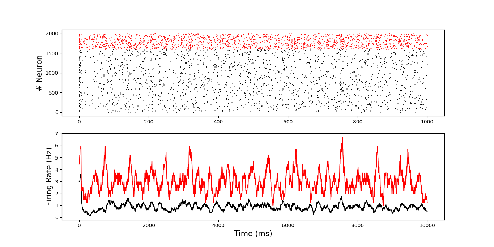
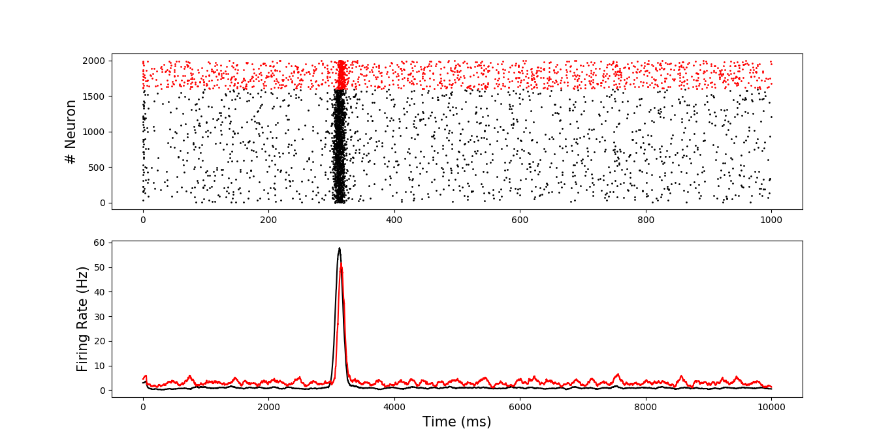
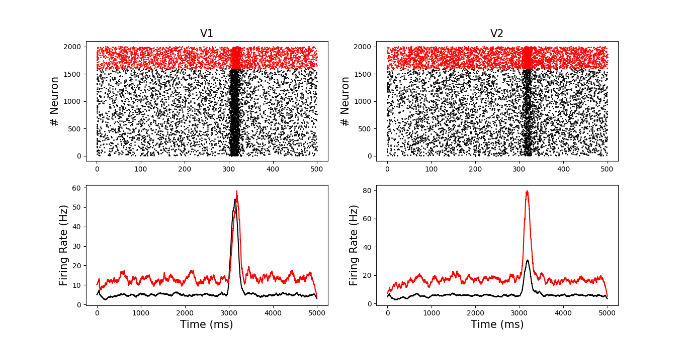

### Tests using pyNN

python code.py arg1 

    arg1:  -neuron or -nest (simulator name)

#### Examples,

python Network.py -nest

python Stimulus.py -nest

python TwoNetworks.py -nest

They are comparable to [Network.ipynb](https://github.com/OpenSourceBrain/JoglekarEtAl18/blob/master/Notebooks/Network.ipynb), [Stimulus.ipynb](https://github.com/OpenSourceBrain/JoglekarEtAl18/blob/master/Notebooks/Stimulus.ipynb) and [TwoNetworks.ipynb](https://github.com/OpenSourceBrain/JoglekarEtAl18/blob/master/Notebooks/TwoNetworks.ipynb), respectively.

