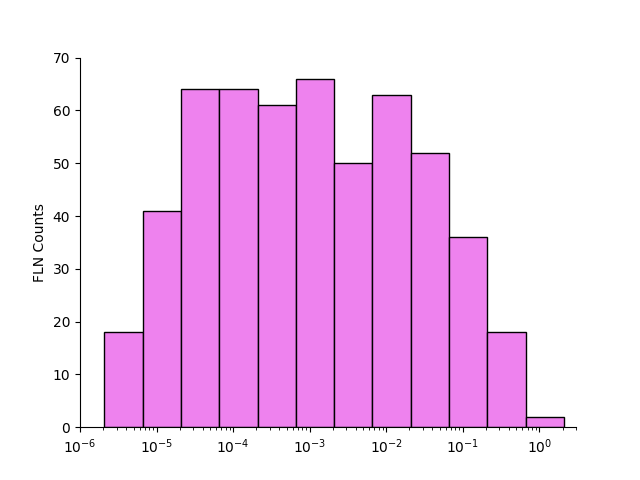
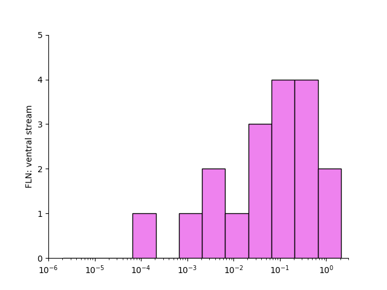

### Python codes

python figure1.py arg1 arg2 

    arg3: save data (input: 'yes' or 'no')

    arg5: use saved data to generate figure (input: 'yes' or 'no')	

python figure2.py 

python figures3.py 

python figures4.py (working in progress...)

python figures5F.py 

python figures5G.py 

